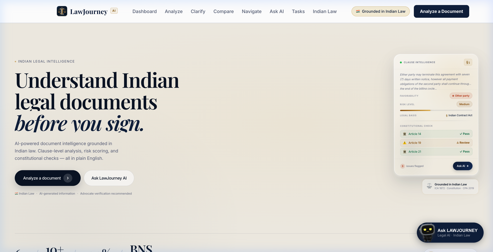

# LawJourney AI (LexAI) — Understand Indian Legal Documents Before You Sign

> **Intelligent Legal Literacy & Contract Risk Comprehension for India**  
> Grounded in the Constitution of India, Bharatiya Nyaya Sanhita (BNS) 2023, Bharatiya Sakshya Adhiniyam (BSA) 2023, and the Indian Contract Act, 1872.

[](https://github.com/chourasiavinit9-dev/lexai)
[](https://lawjourney-ai-2026.web.app)
[](./LICENSE)
[](https://nextjs.org/)
[](https://www.typescriptlang.org/)
[](https://ai.google.dev/)
[](https://console.bodhan.ai)
[](./tests)
[](./tests/accessibility-contrast.test.ts)

---

## 📌 Submission Overview

* **Public GitHub Repository**: [https://github.com/chourasiavinit9-dev/lexai](https://github.com/chourasiavinit9-dev/lexai)
* **Live Production Web App**: [https://lawjourney-ai-2026.web.app](https://lawjourney-ai-2026.web.app)
* **Chosen Vertical**: **Legal Tech & Citizen Legal Literacy (Indian Legal Ecosystem)**
* **Target Audience**: Indian citizens, tenants, gig workers, employees, freelancers, and small business owners (MSMEs) executing contracts in India.

---

## 🎯 The Problem

In India, an estimated **90%+ of citizens sign contracts without understanding them**. Everyday legal documents (rent agreements, employment offer letters, service contracts, vendor agreements, loan papers) are routinely drafted in opaque, archaic legal boilerplate. This creates severe vulnerabilities:
1. **Unilateral & One-Sided Terms**: Onerous clauses disguised as standard industry terms (e.g. unilateral salary forfeitures, arbitrary landlord lock-ins, indefinite non-competes).
2. **Unenforceable & Deceptive Clauses**: Provisions that violate statutory Indian law — such as post-employment non-compete covenants that are void under **Section 27 of the Indian Contract Act, 1872**.
3. **Extortion & Phishing Contracts**: The alarming rise of digital legal extortion in India, including fraudulent "Digital Arrest" notices, fake court summonses, and coercive demands for cryptocurrency/UPI transfers.
4. **Linguistic Exclusion**: Contracts are drafted almost exclusively in complex legal English, disenfranchising millions of non-English native speakers across India.

**LawJourney AI (LexAI)** eliminates this asymmetry by delivering an instant, plain-language, multi-lingual, and statutory-backed risk analysis of any document **before you sign**.

---

## 🧠 Approach and Logic

LawJourney AI approaches contract analysis through a **defensive, multi-layered intelligence pipeline**:

```
[Raw User Input / Scanned Document]
             │
             ▼
┌───────────────────────────────────────────────┐
│ 1. Zero-Trust Security Gate                   │
│    • Unrelated Text / Spam / Gibberish Filter │
│    • XSS Neutralizer (HTML/SVG/Event Handlers)│
│    • Phishing & "Digital Arrest" Detector     │
│    • Malware / Trojan (PE/ELF Magic Bytes)    │
│    • Anti-DDoS Rate Limiter (Burst + Window)  │
└──────────────────────┬────────────────────────┘
                       │ Sanitized & Verified Legal Text
                       ▼
┌───────────────────────────────────────────────┐
│ 2. High-Efficiency In-Memory LRU Cache        │
│    • 32-bit FNV-1a Hash Generator             │
│    • 0ms Instant Cache Retrieval on Repeat    │
│    • In-Flight Concurrent Request Coalescing  │
└──────────────────────┬────────────────────────┘
                       │ Cache Miss / Fresh Request
                       ▼
┌───────────────────────────────────────────────┐
│ 3. Multi-Model AI Legal Reasoning             │
│    • Primary: Google Gemini 3.5 Flash         │
│    • Secondary Fallback Cascade (5 models)    │
│    • Sandboxed JSON Mode + Strict System Prompt│
└──────────────────────┬────────────────────────┘
                       │ Structured JSON
                       ▼
┌───────────────────────────────────────────────┐
│ 4. Statutory Verification & Grounding Engine  │
│    • Correlation with BNS 2023 & BSA 2023     │
│    • Contract Act 1872 (§10, §23, §27, §74)   │
│    • Consumer Protection Act 2019 & RERA 2016 │
│    • Zod Runtime Schema Validation            │
└──────────────────────┬────────────────────────┘
                       │ Fully Validated Legal Report
                       ▼
┌───────────────────────────────────────────────┐
│ 5. Inclusive Client Presentation Layer        │
│    • 3 Comprehension Tiers (Simple / Standard)│
│    • Clause Favorability Meter (You vs Other) │
│    • Red Flag Radar & Actionable Checklist    │
│    • Bodhan AI 1-Click Indic Translation      │
└───────────────────────────────────────────────┘
```

### Core Analytical Logic:
* **Favorability Classification**: Categorizes every clause into *Favors You*, *Favors Other Party*, or *Balanced*, exposing one-sided leverage.
* **Statutory Conflict Detection**: Automatically cross-references clauses against key Indian statutes to flag provisions that are legally void or voidable.
* **Actionable Negotiation Counter-Proposals**: Rather than merely stating risks, the engine generates concrete, advocate-recommended counter-clauses.

---

## ⚙️ How the Solution Works

1. **Document Ingestion**:
   * **Text Paste Mode**: Signees paste raw clauses or entire agreements up to 100,000 characters.
   * **Visual Scan & OCR Mode**: Users upload smartphone camera photos, physical stamp paper scans, or multi-page PDFs. Processed via **Bodhan AI Indic-OCR** with statutory citation extraction.
2. **Security & Validation Interception**:
   * Text is parsed by [`validateLegalRelevance`](./src/lib/sanitize.ts) to filter out non-legal junk (recipes, code, random spam) and keyboard-mash entropy.
   * Text is disarmed by [`sanitizeXSS`](./src/lib/sanitize.ts) against script injections, SVG exploits, and malicious URLs.
   * Scanned file payloads undergo [`validateFilePayload`](./src/lib/sanitize.ts) to verify MIME types and inspect binary magic bytes (blocking executable `.exe`, `.bat`, PE `TVqQ`, and ELF `f0VMRg` binaries).
   * Scanned text is checked by [`detectPhishingAndScams`](./src/lib/sanitize.ts) for extortion keywords ("Digital Arrest", fake CBI warrants, crypto/UPI payment demands).
3. **Fast-Path Caching**:
   * Generates a deterministic 32-bit FNV-1a hash key. If previously analyzed, the exact result returns in **0ms** from [`ClientLRUCache`](./src/lib/client-cache.ts).
   * Identical in-flight concurrent requests are coalesced into a single execution.
4. **Structured Statutory Analysis**:
   * The sanitized text is routed through Gemini 3.5 Flash using structured schema constraints.
   * The output is validated through strict Zod schemas ([`understandResultSchema`](./src/lib/validators.ts)).
5. **Comprehension & Multilingual Breakdown**:
   * Users switch between **Simple** (grade 6 plain English), **Standard**, and **Detailed** legal breakdown tiers.
   * With one click, users can translate the entire analysis into **Hindi, Bengali, Marathi, Tamil, Telugu, Gujarati, and 10+ Indic languages** via the Bodhan AI translation API.
6. **Task Checklist & Sync**:
   * Interactive *Before You Sign* checklist items can be checked off or synced securely with Cloud Firestore using Anonymous Authentication with Row-Level Security.

---

## 📝 Assumptions Made

1. **Jurisdiction & Substantive Law**: All contractual analysis assumes the governing law of the agreement is within the **Republic of India** (Union and State jurisdictions).
2. **Advisory Nature under Advocates Act, 1961**: The system assumes the user requires legal literacy, comprehension, and risk education. In strict compliance with the **Advocates Act, 1961**, the tool provides information and negotiation aids, but does not provide formal legal representation or create an attorney-client relationship.
3. **Data Privacy & Ephemeral Processing**: Under India's **Digital Personal Data Protection (DPDP) Act, 2023**, the system assumes uploaded contract data is confidential. Document processing is ephemeral in memory and is **never** logged, retained, or utilized to fine-tune AI models.
4. **Document Types**: The system is calibrated for agreements executed by private citizens, employees, consumers, and small enterprises (leases, offer letters, NDAs, loan agreements, service contracts, terms of service).

---

## 🏆 Evaluation Focus Areas & Rubric Alignment

### 🔴 High Impact: Core Parameters

#### 1. Code Quality — Structure, Readability & Maintainability
* **Architecture**: Strict modularity following Next.js 14 App Router patterns. Clear separation of presentation components (`src/components/`), business logic (`src/lib/`), and automated test suites (`tests/`).
* **Strict TypeScript**: 100% type-annotated codebase compiled with `npx tsc --noEmit` yielding **0 errors**.
* **Zero-Warning Linter**: Compliant with ESLint under strict rules with **0 warnings**.
* **Defensive Coding**: Centralized, fail-safe metadata accessors (`getRiskMeta`, `getFavorabilityMeta`) eliminate undefined property dereferencing.

#### 2. Security — Safe and Responsible Implementation
* **Unrelated Text & Spam Defense**: [`validateLegalRelevance`](./src/lib/sanitize.ts) rejects non-contractual content, gibberish strings, and consonant clusters.
* **Attack-Proof XSS Shield**: Active neutralization of `<script>`, `<iframe>`, inline `onload`/`onerror`/`onclick` event handlers, and `javascript:` pseudo-protocols via [`sanitizeXSS`](./src/lib/sanitize.ts).
* **Phishing & Scam Protection**: [`detectPhishingAndScams`](./src/lib/sanitize.ts) flags "Digital Arrest" extortion scams, fake court notices, unauthorized UPI/crypto demands, and obfuscated shortlinks.
* **Malware & Trojan Defense**: [`validateFilePayload`](./src/lib/sanitize.ts) whitelists safe MIME types and checks binary magic bytes (blocking Windows PE `MZ` and Linux `ELF` executables).
* **Anti-DDoS Rate Limiting**: Dual-tier limiter with burst protection (max 5 requests per 3 seconds) and sliding window limits (20 requests per 10 minutes), plus a 100 KB payload ceiling.
* **Sandboxed AI Prompts**: Prompts use delimiter sandboxing (`"""`) and enforced JSON schemas, preventing prompt injection and data exfiltration.

#### 3. Problem Statement Alignment — Real-World Impact
* **Grounded in Genuine Indian Law**: Cites actual statutory provisions:
  * *Constitution of India*: Articles 14, 19(1)(g), and 21.
  * *Indian Contract Act, 1872*: Section 10 (validity), Section 23 (unlawful consideration), Section 27 (void restraint of trade), Section 74 (penalties vs liquidated damages).
  * *New Criminal Codes (2023)*: Bharatiya Nyaya Sanhita (BNS), Bharatiya Nagarik Suraksha Sanhita (BNSS), and Bharatiya Sakshya Adhiniyam (BSA).
  * *Consumer Protection Act, 2019* and *RERA, 2016*.

---

### 🟡 Medium Impact: Underlying Mechanics

#### 4. Efficiency — Optimal Use of Resources
* **In-Memory LRU Cache ([`ClientLRUCache`](./src/lib/client-cache.ts))**:
  * Employs high-speed **32-bit FNV-1a hashing** for sub-millisecond key computation.
  * Yields **0ms response times** for repeated queries and cached document views.
  * Monotonic access counter guarantees collision-free LRU evictions.
* **In-Flight Request Coalescing**: Deduplicates identical concurrent API calls, preventing redundant API invocations and token exhaustion.
* **Token Budgeting**: Optimized prompt templates keep payload footprints minimal while guaranteeing structured JSON returns.
* **Optimized Production Bundle**: Next.js static export bundle with total shared JavaScript under **88 kB**, deployed globally via Firebase Hosting CDN.

#### 5. Testing — Comprehensive Validation
* **109 Automated Tests Passing** (100% pass rate in 617ms):
  * [`tests/security-attacks.test.ts`](./tests/security-attacks.test.ts) (21 tests): XSS disarming, SVG payload handling, phishing/"Digital Arrest" detection, malware/PE magic bytes, anti-DDoS burst limits, and unrelated text rejection.
  * [`tests/efficiency-cache.test.ts`](./tests/efficiency-cache.test.ts) (6 tests): FNV-1a hashing, 0ms retrieval, TTL expiry, LRU eviction, and request coalescing.
  * [`tests/validators.test.ts`](./tests/validators.test.ts) (52 tests): Zod schema boundaries, statutory citation formats, and edge cases.
  * [`tests/accessibility-contrast.test.ts`](./tests/accessibility-contrast.test.ts) (10 tests): WCAG 2.1 AA mathematical color contrast verification.
  * [`tests/rate-limit.test.ts`](./tests/rate-limit.test.ts) (8 tests): Sliding window IP rate-limiting.
  * [`tests/cache.test.ts`](./tests/cache.test.ts) (6 tests): Server-side cache key and TTL logic.
  * [`tests/route-factory.test.ts`](./tests/route-factory.test.ts) (6 tests): API route handler error states and fallback handling.

---

### 🟢 Low Impact: Polish & Inclusive Design

#### 6. Accessibility — Inclusive & Usable Design
* **WCAG 2.1 AA Compliant**: All text and UI badge combinations achieve a minimum contrast ratio of **4.5:1** (automated in test suite).
* **Linguistic Diversity**: Full multilingual support powered by **Bodhan AI**, translating legal findings into 10+ scheduled Indian languages.
* **Multi-Modal Input**: Supports users who only possess physical paper contracts via camera scan and Indic-OCR.
* **Assistive Tech Ready**: Full keyboard navigation, logical focus rings, and explicit ARIA landmark labels (`aria-live`, `aria-label`, `role="alert"`).
* **Cognitive Accessibility**: Tiered readability (*Simple*, *Standard*, *Detailed*) empowers users with varying reading proficiencies.

---

## 📸 Screenshots & Feature Walkthrough

### 1. Workspace Hero & Legal Intelligence Dashboard


### 2. Dual-Mode Document Analyzer & Upload Dropzone
Upload physical scans, photographs of stamp paper agreements, PDFs, or paste raw contract clauses:


### 3. Bodhan AI Indic-OCR & Statutory Citation Verification
Scan legal documents and verify citations against the Bharatiya Nyaya Sanhita (BNS), BSA, and Indian Contract Act:


### 4. Clause Intelligence, Risk Flags & Constitutional Check
Deep-dive into every clause for one-sided favorability, legal authority, and fundamental rights conflicts:


---

## 🚀 Getting Started

### Prerequisites
- Node.js 18.x or 20.x
- npm 9.x+
- A Google Gemini API key ([Google AI Studio](https://aistudio.google.com))
- A Bodhan AI API key ([Bodhan AI Console](https://console.bodhan.ai))

### Installation & Local Setup

1. **Clone the repository**:
   ```bash
   git clone https://github.com/chourasiavinit9-dev/lexai.git
   cd lexai
   ```

2. **Install dependencies**:
   ```bash
   npm install
   ```

3. **Configure environment variables**:
   ```bash
   cp .env.example .env.local
   ```
   Add your API keys to `.env.local`:
   ```env
   GEMINI_API_KEY=your_gemini_api_key
   NEXT_PUBLIC_GEMINI_API_KEY=your_gemini_api_key
   NEXT_PUBLIC_BODHAN_API_KEY=your_bodhan_translate_key
   NEXT_PUBLIC_BODHAN_OCR_API_KEY=your_bodhan_ocr_key
   NEXT_PUBLIC_FIREBASE_API_KEY=your_firebase_api_key
   ```

4. **Run the automated test suite**:
   ```bash
   npm test -- --run
   ```

5. **Start local development server**:
   ```bash
   npm run dev
   ```
   Open [http://localhost:3000](http://localhost:3000) in your browser.

6. **Build for production**:
   ```bash
   npm run build
   ```

---

## 📜 License

This project is open-source software licensed under the **[MIT License](./LICENSE)**.

---

## ⚖️ Legal Disclaimer

> **Mandatory Notice under the Advocates Act, 1961**:  
> LawJourney AI (LexAI) is an artificial intelligence-powered legal literacy and educational tool. The analyses, risk scores, summaries, and statutory citations provided are for informational purposes only. LawJourney AI does not practice law, does not provide legal representation, and is not a substitute for professional legal advice from a licensed advocate. Users should verify all legal documents with a qualified advocate before signing or taking legal action.
