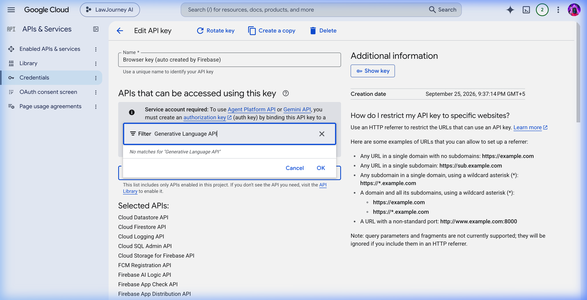
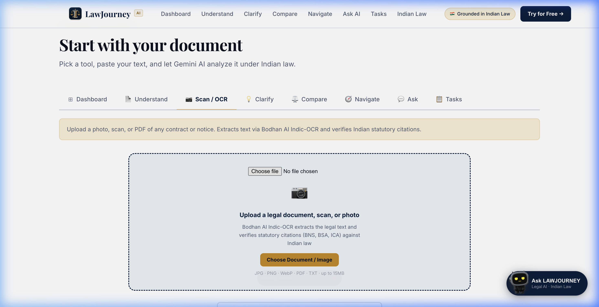
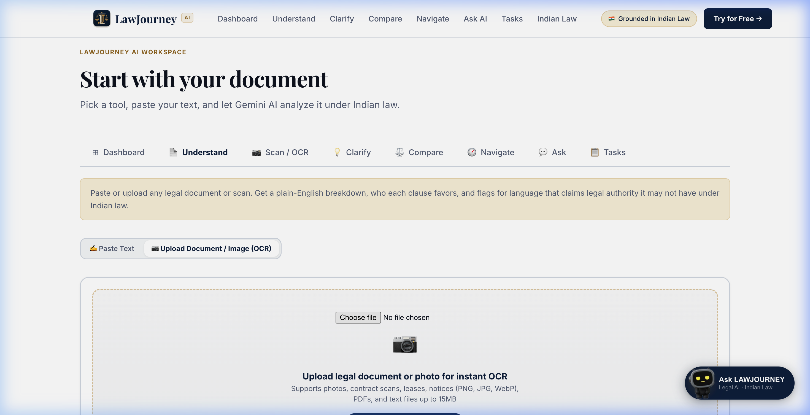
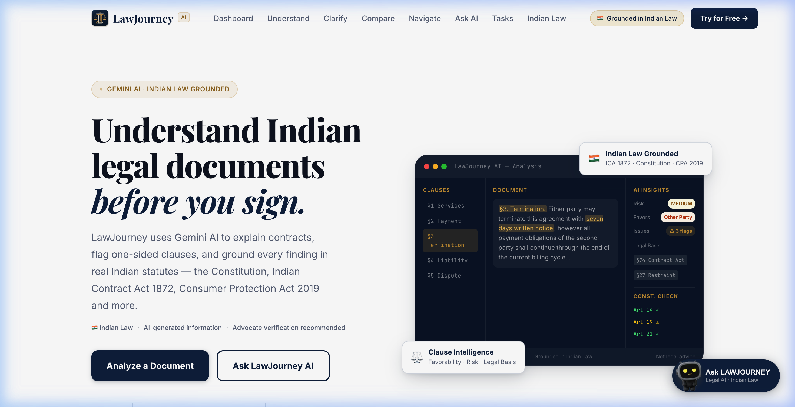
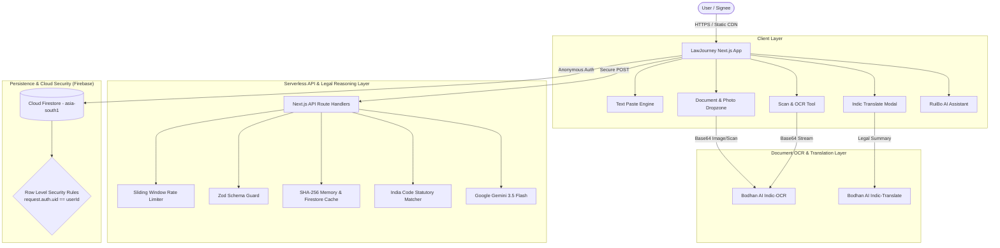

# LawJourney AI (LexAI) — Understand Indian Legal Documents Before You Sign

> **Intelligent Legal Literacy & Contract Risk Comprehension for India**  
> Grounded in the Constitution of India, Bharatiya Nyaya Sanhita (BNS) 2023, Bharatiya Sakshya Adhiniyam (BSA) 2023, and the Indian Contract Act, 1872.

[](https://lawjourney-ai-2026.web.app)
[](./LICENSE)
[](https://nextjs.org/)
[](https://www.typescriptlang.org/)
[](https://ai.google.dev/)
[](https://console.bodhan.ai)
[](./tests)
[](./tests/accessibility-contrast.test.ts)

---

## 📸 Visual Overview

### 1. Workspace Hero & Legal Intelligence Dashboard


### 2. Dual-Mode Document Analyzer & Upload Dropzone
Upload physical scans, photographs of stamp paper agreements, PDFs, or paste raw contract clauses:


### 3. Bodhan AI Indic-OCR & Statutory Citation Verification
Scan legal documents and verify citations against the Bharatiya Nyaya Sanhita (BNS), BSA, and Indian Contract Act:


### 4. Clause Intelligence, Risk Flags & Constitutional Check
Deep-dive into every clause for one-sided favorability, legal authority, and fundamental rights conflicts:


---

## 🎯 The Problem

Legal documents in India (rent agreements, employment letters, service contracts, freelance NDAs, loan agreements) are drafted in archaic legal boilerplate that conceals significant risks:
- **One-sided terms** disguised as standard boilerplate (e.g. unilateral salary deductions or indefinite non-competes).
- **False claims of legal authority** that are unenforceable under Indian law (such as restraining lawful trade under Section 27 of the Indian Contract Act).
- **Fundamental rights infringements** conflicting with Articles 14, 19(1)(g), and 21 of the Constitution of India.
- **Language barriers** for millions of non-English native speakers signing contracts in English.

**LawJourney AI** bridges this gap: giving everyone an accessible, transparent, and accurate plain-English and Indic translation breakdown of any document before signing.

---

## ⚡ Key Features

| Tool | Capability | Indian Legal Basis |
|---|---|---|
| **📄 Understand** | Full document breakdown, plain-English summary, key clauses with risk levels, **who each clause favors**, red flags, and a *Before You Sign* checklist. | Indian Contract Act 1872, CPA 2019, Specific Relief Act 1963 |
| **📷 Scan & OCR** | Upload photos, scans, or PDFs of physical contracts, leases, or notices. Powered by **Bodhan AI Indic-OCR** with statutory citation lookup. | BNS 2023, BNSS 2023, BSA 2023, India Code |
| **💡 Clarify** | Single-clause focus: plain English explanation, risk evaluation, obligations, and negotiation counter-proposals. | ICA 1872 §27 (Restraint of trade), §74 (Penalties) |
| **⚖️ Compare** | Side-by-side comparison of two versions or conflicting contracts, highlighting who benefits from each change. | Comparative contract principles & consumer fairness |
| **🧭 Navigate** | Goal-driven step-by-step roadmap: tell the AI what you want to achieve (e.g. "leave job without notice", "break lease"), and it guides your legal rights and dates. | Employment law, Transfer of Property Act 1882 |
| **💬 Ask AI & RuiBo** | Conversational Q&A on Indian legal concepts, dispute procedures, and document terms with interactive suggestions. | Indian statutory corpus & constitutional jurisprudence |
| **🌐 Indic Translate** | One-click translation of legal summaries into **Hindi, Bengali, Marathi, Tamil, Telugu, Gujarati, and 22+ scheduled languages**. | Bodhan AI Indic-Translate API (`indic-translate`) |
| **📋 Task Checklist** | Interactive action list for document verification, advocate questions, and signing prerequisites synced in real time. | Cloud Firestore with Anonymous Auth & Row-Level Security |

---

## 🏛️ Grounded in Real Indian Law

LawJourney AI is strictly grounded in actual statutes. It refuses to invent fictional laws:
1. **Constitution of India (Part III Fundamental Rights)**:
   - **Article 14**: Equality before law and non-arbitrariness in contracts.
   - **Article 19(1)(g)**: Freedom to practise any profession, trade, or business (protects employees/freelancers from predatory non-compete clauses).
   - **Article 21**: Right to life, personal liberty, and privacy.
2. **Indian Contract Act, 1872**:
   - **Section 10**: What agreements are contracts.
   - **Section 23**: Unlawful objects and considerations contrary to public policy.
   - **Section 27**: Agreements in restraint of trade are void.
   - **Section 28**: Agreements restraining legal proceedings are void.
   - **Section 74**: Distinguishing genuine pre-estimates of liquidated damages from unlawful penalties.
3. **New Criminal & Procedural Codes (2023)**:
   - **Bharatiya Nyaya Sanhita (BNS) 2023** (Sections on breach of trust, cheating, criminal intimidation).
   - **Bharatiya Nagarik Suraksha Sanhita (BNSS) 2023**.
   - **Bharatiya Sakshya Adhiniyam (BSA) 2023** (§63 electronic records admissibility).
4. **Consumer Protection Act, 2019**:
   - Unfair contract terms and unilateral consumer arbitration restrictions.
5. **Digital Personal Data Protection (DPDP) Act, 2023**:
   - Consent protocols, data minimization, and user privacy compliance.

---

## 🏗️ System Architecture



For complete architectural specifications, see [docs/ARCHITECTURE.md](./docs/ARCHITECTURE.md).

---

## 🔒 Security & Privacy Engineering

- **No Client API Key Exposure**: All sensitive API keys (`GEMINI_API_KEY`, `BODHAN_API_KEY`, `OPENROUTER_API_KEY`) remain strictly on server-side runtimes.
- **Row-Level Security (RLS)**: Cloud Firestore rules enforce tenant-isolation (`request.auth.uid == resource.data.userId`). Users cannot read or tamper with another user's documents or tasks.
- **SQL & Input Injection Defense**: All inputs undergo rigorous Zod schema parsing and length capping before any processing.
- **Production Security Headers**:
  - `Content-Security-Policy`: Strictly defined script, connect, and frame restrictions.
  - `Strict-Transport-Security`: `max-age=31536000; includeSubDomains; preload`
  - `X-Frame-Options`: `SAMEORIGIN`
  - `X-Content-Type-Options`: `nosniff`
  - `Referrer-Policy`: `strict-origin-when-cross-origin`
- **DPDP Act 2023 Compliance**: Zero retention default; uploaded legal documents are analyzed in-flight and not stored or used for model training.

---

## 🧪 Testing & Quality Assurance

LawJourney AI maintains an automated test suite executed via Vitest:

```bash
npm test -- --run
```

```text
 ✓ tests/accessibility-contrast.test.ts (10 tests)
 ✓ tests/rate-limit.test.ts (8 tests)
 ✓ tests/validators.test.ts (52 tests)
 ✓ tests/cache.test.ts (6 tests)
 ✓ tests/route-factory.test.ts (6 tests)

 Test Files  5 passed (5)
      Tests  82 passed (82)
   Duration  1.70s
```

- **WCAG 2.1 AA Contrast**: Automated ratio tests on all UI tokens and status pills.
- **Rate-Limiting**: IP sliding window tests preventing quota starvation and abuse.
- **Validation**: 52 schema tests verifying legal citation formats and anti-hallucination guardrails.

---

## 🚀 Getting Started

### Prerequisites
- Node.js 18.x or 20.x
- npm 9.x+
- A Google Gemini API key ([Google AI Studio](https://aistudio.google.com))
- A Bodhan AI API key ([Bodhan AI Console](https://console.bodhan.ai))

### Installation

1. **Clone the repository**:
   ```bash
   git clone https://github.com/chourasiavinit9-dev/lexai.git
   cd lexai
   ```

2. **Install dependencies**:
   ```bash
   npm install
   ```

3. **Configure environment variables**:
   ```bash
   cp .env.example .env.local
   ```
   Edit `.env.local` with your API keys:
   ```env
   GEMINI_API_KEY=your_gemini_api_key
   NEXT_PUBLIC_GEMINI_API_KEY=your_gemini_api_key
   NEXT_PUBLIC_BODHAN_API_KEY=your_bodhan_translate_key
   NEXT_PUBLIC_BODHAN_OCR_API_KEY=your_bodhan_ocr_key
   NEXT_PUBLIC_FIREBASE_API_KEY=your_firebase_api_key
   ```

4. **Run the local development server**:
   ```bash
   npm run dev
   ```
   Open [http://localhost:3000](http://localhost:3000) in your browser.

5. **Build for production**:
   ```bash
   npm run build
   ```

---

## 📜 License

This project is open-source software licensed under the **[MIT License](./LICENSE)**.

---

## ⚖️ Legal Disclaimer

> **Mandatory Notice under the Advocates Act, 1961**:  
> LawJourney AI is an artificial intelligence-powered legal literacy and educational tool. The analyses, risk scores, summaries, and statutory citations provided are for informational purposes only. LawJourney AI does not practice law, does not provide legal representation, and is not a substitute for professional legal advice from a licensed advocate. Users should verify all legal documents with a qualified advocate before signing or taking legal action.
