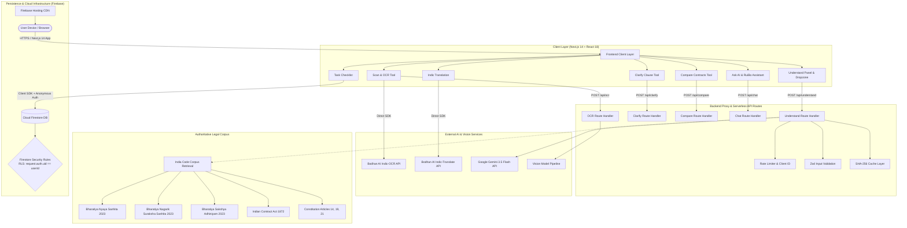
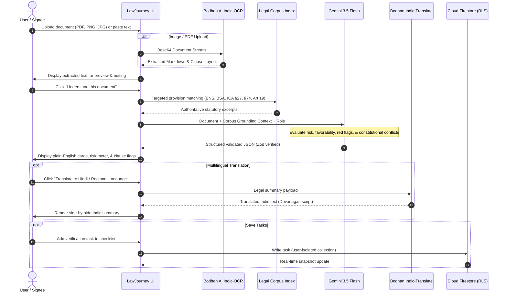

# LawJourney AI (LexAI) — System Architecture & Workflow

## Overview
LawJourney AI is a production-grade legal literacy and contract comprehension platform built specifically for the Indian legal framework. It combines Google's Gemini 3.5 Flash models with Bodhan AI Indic-OCR and Indic-Translate engines to simplify complex contracts, leases, NDAs, and legal notices into actionable, plain-English insights before a user signs.

---

## 1. High-Level System Architecture



---

## 2. End-to-End Document Processing Pipeline



---

## 3. Security, Privacy & Database Protection

### Row-Level Security (RLS)
Cloud Firestore data access is restricted through strict security rules (`firestore.rules`). Every read, write, and mutation requires matching authentication context:

```javascript
rules_version = '2';
service cloud.firestore {
  match /databases/{database}/documents {
    match /users/{userId}/{document=**} {
      allow read, write: if request.auth != null && request.auth.uid == userId;
    }
    match /tasks/{taskId} {
      allow read, write: if request.auth != null && request.auth.uid == resource.data.userId;
      allow create: if request.auth != null && request.auth.uid == request.resource.data.userId;
    }
  }
}
```

### Zero Key Exposure
- Server-side environment variables (`GEMINI_API_KEY`, `OPENROUTER_API_KEY`, `BODHAN_API_KEY`) are isolated from client bundles.
- All proxy endpoints enforce strict origin validation and Content-Security-Policy headers.

### Input Sanitization & Anti-Injection
- Strict **Zod schemas** validate every field, character limit, and enum at the boundary.
- Zero raw SQL evaluation or dynamic code execution prevents parameter tampering and prototype pollution.
